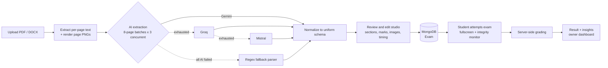
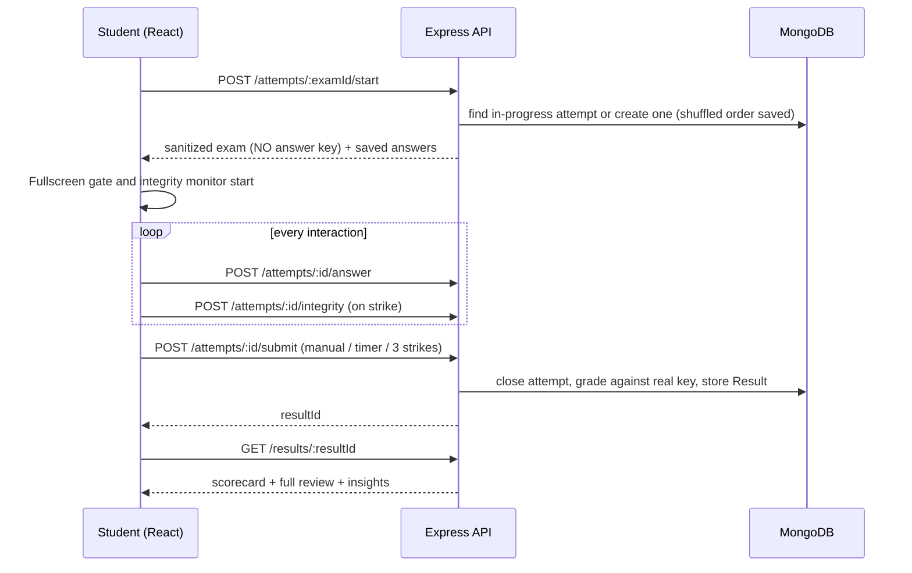
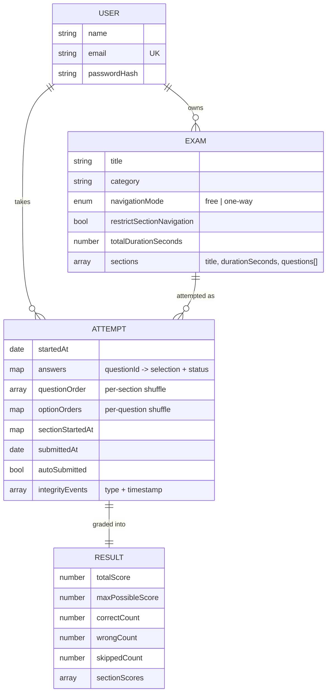

# EXORA

### Smarter. Safer. Assessments.

**Turn a question-paper PDF or Word file into a secure, timed, auto-graded online exam, with post-exam analytics included.**


[Features](#-features) · [How it works](#-how-it-works) · [Architecture](#-architecture) · [Quick start](#-quick-start) · [API](#-api-reference) · [Security model](#-security-model) · [Roadmap](#-known-limitations--roadmap)

</div>

---

## Why EXORA?

Preparing an online mock test usually means retyping hundreds of questions into a form builder. EXORA removes that step. Upload the paper you already have and an AI pipeline reads **every page as both text and an image**, so tables, diagrams, trees and exponents survive extraction. You review and edit the draft, configure timing and marking, and publish. Students then sit the exam in a fullscreen, integrity-monitored environment, and the server grades them against an answer key they never see.

> Built with competitive-exam workflows in mind (GATE, SSC, Banking and similar): negative marking, MCQ + MSQ + typed-answer questions, sectional timers, question palettes and mark-for-review.

---

## ✨ Features

### 🧠 AI-powered exam creation
- **Upload PDF or Word** question papers (up to 10 MB).
- **Multimodal extraction.** Each PDF page is rendered to a 2× PNG *and* its text is extracted, then both are sent to the model. The images are the source of truth for tables, diagrams and superscripts, and the text confirms exact wording.
- **Three-tier AI failover:** Gemini → Groq → Mistral. Each provider has its own model-candidate list and moves to the next model on `429 / 503 / 404`. Groq and Mistral are optional and silently skipped if no key is set.
- **Regex fallback parser** if every AI tier fails, so an upload never dead-ends. The UI shows a warning banner when this happens.
- **Batched, concurrent processing.** Large PDFs (up to 300 pages) are split into 8-page batches and processed 3 at a time, which avoids silent truncation and keeps wall-clock time reasonable.
- **Answer detection.** If the paper contains inline answers, bold or marked options, or an answer key, the correct options are pre-filled. If the answer can't be determined, the field is left empty rather than guessed.
- **Tree/graph aware.** The extraction prompt forces explicit parent→child lines, so a tree diagram never becomes an ambiguous list of numbers.

### ✍️ Review and edit studio
- Edit any parsed question, option, correct answer or marks before saving.
- Three question types: **MCQ**, **MSQ** (multi-select) and **Numerical / typed answer**. The typed-answer type accepts formulas and words as well as numbers, e.g. `O(n log n)` or `True`.
- Attach **diagram images** to questions. Images are compressed client-side (max 800 px, JPEG 70%) before being stored.
- **Sections:** create them, then bulk-assign a range of questions (e.g. Q1–Q25 → *Aptitude*) with the Section Assign tool.
- **Categories** (GATE, SSC, …) with autocomplete from your existing ones. The dashboard groups exams by category.
- Edit saved exams later. **Original IDs are preserved**, so existing attempts and results never break.

### ⏱️ Flexible exam engine
| Setting | Options |
|---|---|
| **Navigation** | `free` (move back and forth) or `one-way` (forward only) |
| **Section model** | **Shared timer**: one overall clock and free jumping between sections. **Restricted**: strictly sequential sections, each with its own mandatory timer |
| **Marking** | Positive and negative marks per question. Typed-answer questions default to 0 negative |
| **Randomisation** | Questions (within sections) and options are shuffled **per attempt**. The order is saved, so a refresh shows the same order |
| **Resume** | Refreshing or reconnecting resumes the same attempt. The timer is anchored to the server-recorded start time and never restarts |

### 🛡️ Integrity monitoring
- **Fullscreen gate.** Nothing is shown or tracked until the student clicks *Enter fullscreen & start*.
- **Detects** tab switches, window focus loss, fullscreen exit and blocked shortcuts. Every event is **logged server-side with a timestamp**.
- **3-strike policy.** Strikes from any combination of the above count together. The 3rd auto-submits the exam, after a must-acknowledge warning modal on each strike.
- **10-second fullscreen-exit countdown**, driven by a wall-clock deadline so it can't drift or fire early.
- **Flicker-proof detection.** A 600 ms "return dwell" stops one real action, such as a PrintScreen overlay, from being counted as multiple strikes.
- **Lockdown deterrents:** copy, cut, paste and right-click are disabled, and DevTools and view-source shortcuts (F12, Ctrl/Cmd+Shift+I/J/C, Ctrl/Cmd+U) are blocked.
- **Desktop-only** attempts (≥ 1024 px viewport).
- Exam owners see a **violation count per student** on the results overview.

### 📊 Results and insights
- Instant server-side grading with a scorecard (score, correct / wrong / skipped) and **per-section breakdown**.
- **Question-by-question review** showing your answer against the correct one. Correct answers are revealed only *after* submission.
- **Rule-based insights:**
  - strongest and weakest section by accuracy
  - sections where you spent more than **1.5×** your fair share of time
  - accuracy by question type (MCQ / MSQ / Numerical)
- **Download your analysis** as a self-contained HTML file (images included) that can be printed to PDF.
- **Owner view:** every attempt on your exam, with student, score, submit time, auto-submit flag and integrity flags. Owners can open any student's full result.

### 🎨 Polish
- Light and dark themes (follows the OS preference, then remembers your choice).
- Question palette with Not-visited / Attempted / Not-attempted / Marked-for-review states.
- Submit-confirmation summary, loading-state messaging for long parses, and two-step "armed" delete for exams.

---

## 🔄 How it works



### Attempt lifecycle



---

## 🏗️ Architecture

```
┌──────────────────────────┐        REST/JSON + JWT         ┌────────────────────────────┐
│  Client  (React + Vite)  │ ─────────────────────────────▶ │  Server  (Node + Express)  │
│  Zustand · Tailwind v4   │                                │  Controllers → Services    │
│  Integrity hooks         │ ◀───────────────────────────── │  Mongoose models           │
└──────────────────────────┘                                └─────────┬──────────────────┘
                                                                      │
                          ┌───────────────────────────────────────────┼─────────────────────┐
                          ▼                                           ▼                     ▼
                  ┌──────────────┐                         ┌────────────────────┐   ┌──────────────┐
                  │   MongoDB    │                         │ MuPDF · pdf-parse  │   │ Gemini → Groq│
                  │ User · Exam  │                         │ mammoth (parsing)  │   │ → Mistral    │
                  │ Attempt·Result│                        └────────────────────┘   └──────────────┘
                  └──────────────┘
```

### Tech stack

| Layer | Technology |
|---|---|
| **Frontend** | React 18, React Router 6, Zustand, Axios, Tailwind CSS 4 (`@tailwindcss/vite`), Vite 5 |
| **Backend** | Node.js (ES modules), Express 4, Mongoose 8, Multer (memory storage), CORS |
| **Auth** | JSON Web Tokens (7-day expiry), bcryptjs (10 rounds) |
| **Document parsing** | MuPDF (page rendering + structured text), `pdf-parse`, `mammoth` (Word) |
| **AI** | Google Gemini (primary), Groq (Llama 4 vision), Mistral (Pixtral). All use free tiers |
| **Database** | MongoDB (Atlas-ready) |

### Project structure

```
secure-exam-platform/
├── client/                          # React SPA
│   ├── public/logo.png
│   └── src/
│       ├── pages/                   # Login, Signup, Dashboard, CreateExam, ReviewParsedExam,
│       │                            # ExamAttempt, Result, ExamResultsOverview
│       ├── components/
│       │   ├── examCreation/        # Dropzone, config form, section tools, question editor
│       │   ├── examAttempt/         # Timer, palette, question card, fullscreen gate,
│       │   │                        # strike / countdown / submit modals, navigation
│       │   ├── result/              # Score summary, answer review, insights card
│       │   └── layout/              # Brand, footer, theme toggle, protected route
│       ├── hooks/
│       │   ├── useIntegrityMonitor.js   # tab / blur / fullscreen detection + strike logging
│       │   ├── useExamLockdown.js       # copy/paste/right-click/devtools deterrents
│       │   └── useCountdownTimer.js
│       ├── store/                   # Zustand: auth, exam session, theme
│       ├── api/                     # Axios client + per-resource API modules
│       └── utils/                   # image compression, HTML analysis export, formatting
│
└── server/
    └── src/
        ├── controllers/             # auth, exam, attempt, result
        ├── routes/                  # /auth  /exams  /attempts  /results
        ├── models/                  # User, Exam, Attempt, Result
        ├── middleware/              # JWT auth, multer upload, JSON error handler
        ├── services/
        │   ├── aiQuestionExtractorService.js   # Gemini → Groq → Mistral failover
        │   ├── pdfToImagesService.js           # MuPDF: page PNG + text, paired per page
        │   ├── pdfBatchExtractionService.js    # batching + bounded concurrency
        │   ├── questionNormalization.js        # extraction prompt + schema normalizer
        │   ├── questionExtractorService.js     # regex fallback parser
        │   ├── sanitizeExamService.js          # strips the answer key for attempts
        │   ├── shuffleService.js               # Fisher–Yates per-attempt shuffle
        │   ├── gradingService.js               # scoring engine
        │   ├── answerMatching.js               # shared matcher (grading == review)
        │   └── insightService.js               # weak/strong section, time & type insights
        └── utils/generateToken.js
```

---

## 🚀 Quick start

### Prerequisites
- **Node.js 18+** (uses the built-in `fetch`)
- A **MongoDB** connection string ([MongoDB Atlas](https://www.mongodb.com/atlas) free tier works)
- A free **Gemini API key** from [Google AI Studio](https://aistudio.google.com/apikey) (no card required)

### 1. Backend

```bash
cd server
npm install
cp .env.example .env     # then fill in the values below
npm run dev              # http://localhost:5000
```

### 2. Frontend

```bash
cd client
npm install
npm run dev              # http://localhost:5173
```

### 3. Try it

1. Sign up and log in.
2. On the dashboard click **+ Create exam** and upload a question paper (PDF or Word).
3. Review the parsed questions, set the title, category, timing, sections and marking, then **Save**.
4. Click **Take exam**, enter fullscreen, and attempt it.
5. Submit, then explore the scorecard, insights and the owner results overview.

### Environment variables

**`server/.env`**

| Variable | Required | Description |
|---|:---:|---|
| `PORT` | – | API port (default `5000`) |
| `CLIENT_URL` | ✅ | Allowed CORS origin, e.g. `http://localhost:5173` |
| `MONGO_URI` | ✅ | MongoDB connection string |
| `JWT_SECRET` | ✅ | Long random string used to sign tokens |
| `GEMINI_API_KEY` | ✅ | Primary AI provider |
| `GROQ_API_KEY` | – | Optional fallback tier 2 (skipped if empty) |
| `MISTRAL_API_KEY` | – | Optional fallback tier 3 (skipped if empty) |

**Client (build-time)**

| Variable | Description |
|---|---|
| `VITE_API_URL` | API base URL, e.g. `https://api.example.com/api`. Defaults to `http://localhost:5000/api`. Vite inlines this at **build** time, so set it wherever `npm run build` runs. |

### Scripts

| Where | Command | What it does |
|---|---|---|
| `server` | `npm run dev` | Start with `node --watch` (auto-reload) |
| `server` | `npm start` | Start for production |
| `client` | `npm run dev` | Vite dev server |
| `client` | `npm run build` | Production build to `dist/` |
| `client` | `npm run preview` | Preview the production build |

---

## 📡 API reference

All routes except signup and login require `Authorization: Bearer <token>`.

### Auth: `/api/auth`
| Method | Route | Description |
|---|---|---|
| `POST` | `/signup` | Create an account, returns `{ token, user }` |
| `POST` | `/login` | Log in, returns `{ token, user }` |
| `GET` | `/me` | Current user |

### Exams: `/api/exams`
| Method | Route | Description |
|---|---|---|
| `POST` | `/parse` | Multipart upload (`file`) returning AI-parsed draft questions and a `usedFallback` flag |
| `POST` | `/` | Save a reviewed exam |
| `GET` | `/` | List your exams (summary + last result id) |
| `GET` | `/:examId/edit` | Load an exam in editor shape |
| `PUT` | `/:examId` | Update an exam, preserving existing IDs |
| `DELETE` | `/:examId` | Delete an exam **and** all its attempts and results |
| `GET` | `/:examId/results` | Owner view: all student attempts with scores and integrity flags |

### Attempts: `/api/attempts`
| Method | Route | Description |
|---|---|---|
| `POST` | `/:examId/start` | Start or resume an attempt. Returns the sanitized exam (no answer key) |
| `POST` | `/:attemptId/section/:sectionId/start` | Record the first open of a section (idempotent) |
| `POST` | `/:attemptId/answer` | Save or update a single answer |
| `POST` | `/:attemptId/integrity` | Log an integrity event |
| `POST` | `/:attemptId/submit` | Finalize and grade the attempt |

### Results: `/api/results`
| Method | Route | Description |
|---|---|---|
| `GET` | `/:resultId` | Scorecard, full review with answers, and insights. Visible to the student or the exam owner only |

---

## 🧮 Grading rules

| Question type | Correct | Wrong | Blank |
|---|---|---|---|
| **MCQ / MSQ** | `+positiveMarks` if the selected set **exactly equals** the correct set | `−negativeMarks` | `0` |
| **Numerical / typed** | `+positiveMarks` on a case-insensitive, trimmed match | `−negativeMarks` (default `0`) | `0` |

There is no partial credit for MSQ. The *same* matching function powers both grading and the review page, so the review can never disagree with the score.

---

## 🔐 Security model

**Enforced on the server**
- **The answer key never reaches the client during an attempt.** `sanitizeExamService` is the single choke point that strips `correctOptionIds` and correct answers. Keys are revealed only on a *submitted* attempt's result.
- **Grading happens only on the server**, at submit time.
- **Ownership checks:** only owners can edit, delete or list results for their exams. A result is readable only by its student or the exam owner, and anyone else gets a `404`.
- **Passwords** are hashed with bcrypt, and sessions use signed, expiring JWTs.
- Uploads are limited to PDF/Word and 10 MB, JSON bodies to 25 MB, and PDF rendering to 300 pages.
- Writes to an attempt are scoped to in-progress attempts of the authenticated user.
- All errors return clean JSON, never HTML stack pages.

**Client-side deterrents (honest about their limits)**
Fullscreen, focus tracking and shortcut blocking are **detection and deterrence, not a guarantee**. A determined user can always use a second device or an OS-level tool, and no browser JavaScript can prevent that. EXORA is designed to make cheating inconvenient and visible: every event is timestamped, persisted and shown to the exam owner, and three strikes ends the attempt. The student-facing copy says this plainly.

---

## 🗄️ Data model



Questions are embedded in sections inside the `Exam` document: `type` (`mcq | msq | numerical`), `text`, optional base64 `imageData`, `options[]`, `correctOptionIds[]`, `correctNumericalAnswer`, and `positiveMarks` / `negativeMarks`.

---

## 🧩 Notable engineering decisions

- **Page-image + text pairing.** MuPDF produces both from the same page, so boundaries line up exactly and batching is clean.
- **Bounded-concurrency worker pool** rather than sequential (too slow) or `Promise.all` over everything (rate-limit pain).
- **Provider failover on retryable errors only.** `429/503/404` move to the next model, while auth failures stop early.
- **Order-stable edits.** `updateExam` keeps real `_id`s for existing sections, questions and options, so historical results stay valid after an edit.
- **Wall-clock deadlines** for countdowns instead of decrementing counters, so they can't drift or fire early.
- **React overlay instead of `window.alert()`** for strike warnings, because a native alert steals focus and would itself trigger a fake violation.
- **Keyed route remounting** (`key={examId}`) so integrity state can't leak between two attempts.
- **Presentation order stored on the attempt**, so a refresh doesn't reshuffle and a retake gets a fresh shuffle. Grading compares option IDs, never positions.

---

## ⚠️ Known limitations & roadmap

Being upfront about what this version does *not* do yet:

- [ ] **Server-side time enforcement.** Timers and the 3-strike rule currently run in the client, with the server recording start times and events. Rejecting answers or submits past the deadline, and enforcing strikes server-side, would harden this.
- [ ] **Roles and exam access control.** Any registered user can start any exam by ID, and "owner" simply means the creator. Invite links, enrolment lists or an explicit student role would fit here.
- [ ] **Rate limiting and security headers** (e.g. `express-rate-limit`, `helmet`) on auth and AI-parse endpoints.
- [ ] **Token storage.** The JWT is held in `localStorage`. Moving to httpOnly cookies would reduce XSS exposure.
- [ ] **Legacy `.doc` files.** The upload filter accepts them, but the parser (`mammoth`) targets `.docx`.
- [ ] **Regex fallback** only detects MCQ/MSQ, because typed-answer questions need AI.
- [ ] **Image storage** is base64 inside MongoDB documents. Object storage (S3 or similar) would scale better.
- [ ] **Automated tests and CI.**
- [ ] Ideas: PDF export of results, question banks, partial credit for MSQ, per-student analytics trends, webcam proctoring (opt-in).

---

## 🤝 Contributing

1. Fork the repo and create a feature branch: `git checkout -b feature/amazing-idea`
2. Commit your changes with a clear message
3. Push the branch and open a Pull Request

Please don't commit `.env` files or API keys. They're already in `.gitignore`.

---

<div align="center">

**EXORA** · *Smarter. Safer. Assessments.*

</div>
